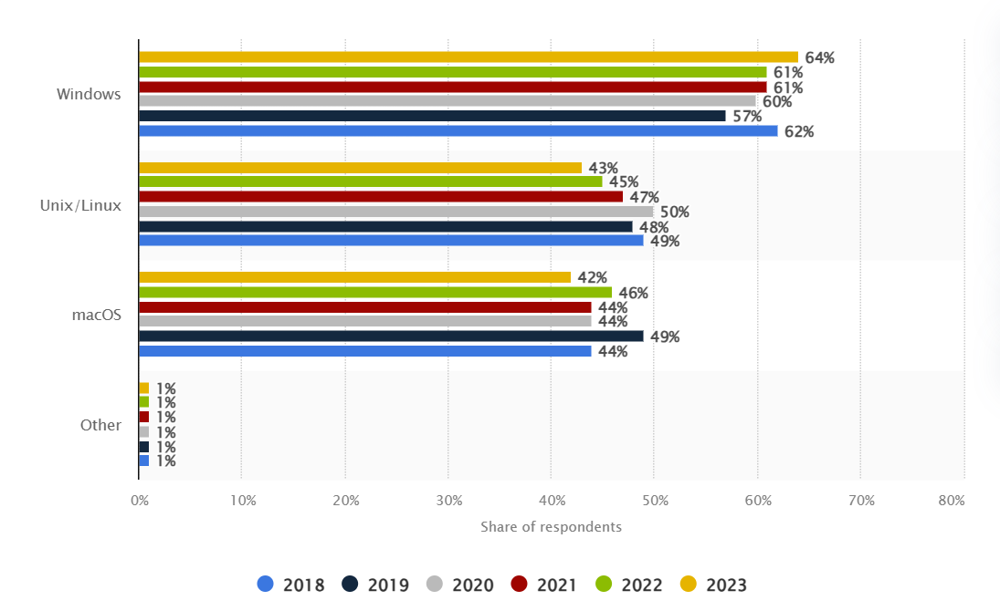
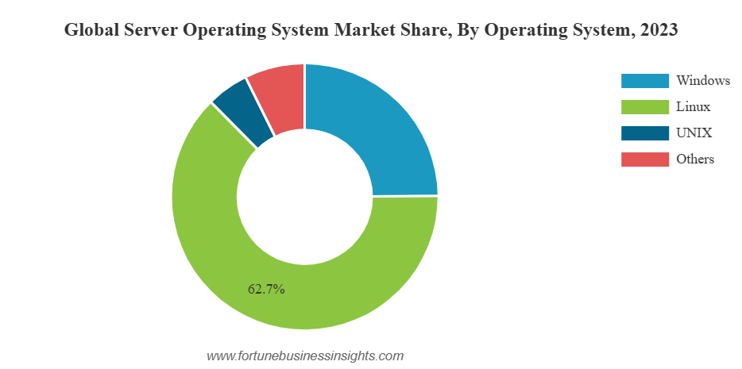

+++
title = "Qu'est-ce que Linux ?"
weight = 11
+++

## Qu’est-ce que Linux ?
{}
Linux est un **système d'exploitation** puissant et flexible qui offre de nombreux avantages, notamment en termes de sécurité, de stabilité, et de personnalisation. 
{}

Que ce soit pour un usage personnel, professionnel, ou pour des serveurs, Linux est une option solide et fiable.

### Un peu d'histoire
- **1991** : Créé par ***Linus Torvalds*** et est basé sur le système ***Unix***. 
- **1992** : Le noyau Linux a été re-licencié sous la licence publique générale GNU (GPL), ce qui a renforcé son statut de logiciel libre.
- **1994** : La version 1.0 du noyau Linux a été publiée, marquant une étape importante dans son développement.

Depuis sa création, Linux est devenu l'un des systèmes d'exploitation les plus populaires, notamment pour les serveurs, les superordinateurs, et les appareils embarqués.

### Caractéristiques principales
1. **Open Source** : Le code source de Linux est disponible gratuitement, permettant aux utilisateurs de le modifier et de le distribuer.
2. **Sécurité** : Linux est réputé pour sa robustesse et sa sécurité. Les mises à jour régulières et la communauté active contribuent à maintenir un haut niveau de sécurité.
3. **Stabilité** : Linux est connu pour sa stabilité et sa capacité à fonctionner pendant de longues périodes sans nécessiter de redémarrage.
4. **Personnalisation** : Les utilisateurs peuvent personnaliser leur environnement Linux selon leurs besoins, grâce à une multitude de distributions et d'outils disponibles.

### Distributions Linux
{}
Une **distribution Linux** est une version de Linux qui inclut le noyau Linux ainsi que divers logiciels et outils.
{}

 Voici quelques-unes des distributions les plus populaires :
- **Ubuntu** : Connue pour sa convivialité et son support communautaire.  
[Site d'Ubuntu](https://ubuntu.com/)
- **Fedora** : Souvent utilisée par les développeurs et les administrateurs système.  
[Site de Fedora](https://fedoraproject.org/)
- **Red Hat** : L'une des premières distributions commerciales de Linux. Elle est particulièrement populaire dans les environnements d'entreprise.  
[Site de Red Hat](https://www.redhat.com/fr)
- **Debian** : Réputée pour sa stabilité et sa large collection de logiciels.  
[site de Debian](https://www.debian.org/index.fr.html)
- **Arch Linux** : Appréciée par les utilisateurs avancés pour sa flexibilité et sa simplicité.  
[Site d'Arch Linux](https://archlinux.org/)

### Utilisations de Linux
- **Serveurs** : Linux est largement utilisé pour les serveurs web, les serveurs de bases de données, et les serveurs de fichiers en raison de sa fiabilité et de sa sécurité.
- **Superordinateurs** : La majorité des superordinateurs dans le monde fonctionnent sous Linux.
- **Appareils embarqués** : De nombreux appareils, tels que les routeurs, les téléviseurs intelligents, et les smartphones (via Android), utilisent Linux.
- **Postes de travail** : Bien que moins courant que Windows ou macOS, Linux est utilisé par de nombreux développeurs et professionnels de l'informatique pour ses capacités de personnalisation et ses outils puissants.

### Répartition des SE chez les développeurs

[Répartition des systèmes d'exploitation pour le développement de logiciels dans le monde de 2018 à 2023](https://www.statista.com/statistics/869211/worldwide-software-development-operating-system/)

### Part de marché des SE pour les serveurs 

[Part de marché des systèmes d'exploitation pour les serveurs](https://www.fortunebusinessinsights.com/server-operating-system-market-106601)

### Avantages de Linux
- **Gratuit** : Contrairement à certains systèmes d'exploitation propriétaires, Linux est gratuit à télécharger et à utiliser.
- **Communauté active** : Une vaste communauté de développeurs et d'utilisateurs contribue à l'amélioration continue de Linux.
- **Support matériel** : Linux supporte une large gamme de matériels, des anciens ordinateurs aux derniers modèles.
